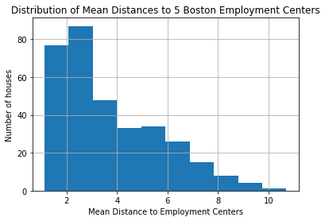
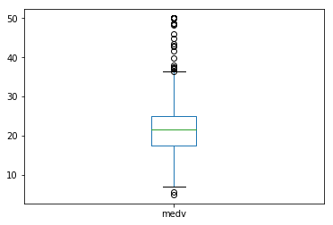
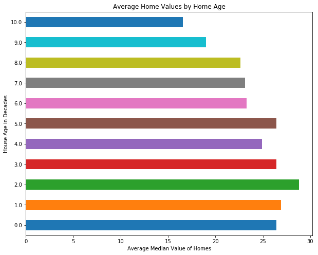

# Project - EDA with Pandas Using the Ames Housing Data

## Introduction

In this section, you've learned a lot about importing, cleaning up, analyzing (using descriptive statistics) and visualizing data. In this more free-form project, you'll get a chance to practice all of these skills with the Ames Housing dataset, which contains housing values in the suburbs of Ames.

## Objectives

You will be able to:

* Perform a full exploratory data analysis process to gain insight about a dataset 

## Goals

Use your data munging and visualization skills to conduct an exploratory analysis of the dataset below. At a minimum, this should include:

* Loading the data (which is stored in the file ``ames_train.csv``) 
* Use built-in Python functions to explore measures of centrality and dispersion for at least 3 variables
* Create *meaningful* subsets of the data using selection operations like `.loc`, `.iloc`, or related operations.   Explain why you used the chosen subsets and do this for three possible 2-way splits. State how you think the two measures of centrality and/or dispersion might be different for each subset of the data.
* Next, use histograms and scatter plots to see whether you observe differences for the subsets of the data. Make sure to use subplots so it is easy to compare the relationships.

## Variable Descriptions
Look in ``data_description.txt`` for a full description of all variables.

A preview of some of the columns:

**MSZoning**: Identifies the general zoning classification of the sale.
		
       A	 Agriculture
       C	 Commercial
       FV	Floating Village Residential
       I	 Industrial
       RH	Residential High Density
       RL	Residential Low Density
       RP	Residential Low Density Park 
       RM	Residential Medium Density

**OverallCond**: Rates the overall condition of the house

       10	Very Excellent
       9	 Excellent
       8	 Very Good
       7	 Good
       6	 Above Average	
       5	 Average
       4	 Below Average	
       3	 Fair
       2	 Poor
       1	 Very Poor

**KitchenQual**: Kitchen quality

       Ex	Excellent
       Gd	Good
       TA	Typical/Average
       Fa	Fair
       Po	Poor

**YrSold**: Year Sold (YYYY)

**SalePrice**: Sale price of the house in dollars


```python
# Let's get started importing the necessary libraries
```


```python
# __SOLUTION__ 
# Let's get started importing the necessary libraries
import pandas as pd
import numpy as np
import matplotlib.pyplot as plt
%matplotlib inline
```


```python
# Loading the data
```


```python
# __SOLUTION__ 
# Loading the data
df = pd.read_csv('ames_train.csv')
print(df.shape)
df.head()
```

    (1460, 81)


<div>
<style scoped>
    .dataframe tbody tr th:only-of-type {
        vertical-align: middle;
    }

    .dataframe tbody tr th {
        vertical-align: top;
    }

    .dataframe thead th {
        text-align: right;
    }
</style>
<table border="1" class="dataframe">
  <thead>
    <tr style="text-align: right;">
      <th></th>
      <th>Id</th>
      <th>MSSubClass</th>
      <th>MSZoning</th>
      <th>LotFrontage</th>
      <th>LotArea</th>
      <th>Street</th>
      <th>Alley</th>
      <th>LotShape</th>
      <th>LandContour</th>
      <th>Utilities</th>
      <th>...</th>
      <th>PoolArea</th>
      <th>PoolQC</th>
      <th>Fence</th>
      <th>MiscFeature</th>
      <th>MiscVal</th>
      <th>MoSold</th>
      <th>YrSold</th>
      <th>SaleType</th>
      <th>SaleCondition</th>
      <th>SalePrice</th>
    </tr>
  </thead>
  <tbody>
    <tr>
      <th>0</th>
      <td>1</td>
      <td>60</td>
      <td>RL</td>
      <td>65.0</td>
      <td>8450</td>
      <td>Pave</td>
      <td>NaN</td>
      <td>Reg</td>
      <td>Lvl</td>
      <td>AllPub</td>
      <td>...</td>
      <td>0</td>
      <td>NaN</td>
      <td>NaN</td>
      <td>NaN</td>
      <td>0</td>
      <td>2</td>
      <td>2008</td>
      <td>WD</td>
      <td>Normal</td>
      <td>208500</td>
    </tr>
    <tr>
      <th>1</th>
      <td>2</td>
      <td>20</td>
      <td>RL</td>
      <td>80.0</td>
      <td>9600</td>
      <td>Pave</td>
      <td>NaN</td>
      <td>Reg</td>
      <td>Lvl</td>
      <td>AllPub</td>
      <td>...</td>
      <td>0</td>
      <td>NaN</td>
      <td>NaN</td>
      <td>NaN</td>
      <td>0</td>
      <td>5</td>
      <td>2007</td>
      <td>WD</td>
      <td>Normal</td>
      <td>181500</td>
    </tr>
    <tr>
      <th>2</th>
      <td>3</td>
      <td>60</td>
      <td>RL</td>
      <td>68.0</td>
      <td>11250</td>
      <td>Pave</td>
      <td>NaN</td>
      <td>IR1</td>
      <td>Lvl</td>
      <td>AllPub</td>
      <td>...</td>
      <td>0</td>
      <td>NaN</td>
      <td>NaN</td>
      <td>NaN</td>
      <td>0</td>
      <td>9</td>
      <td>2008</td>
      <td>WD</td>
      <td>Normal</td>
      <td>223500</td>
    </tr>
    <tr>
      <th>3</th>
      <td>4</td>
      <td>70</td>
      <td>RL</td>
      <td>60.0</td>
      <td>9550</td>
      <td>Pave</td>
      <td>NaN</td>
      <td>IR1</td>
      <td>Lvl</td>
      <td>AllPub</td>
      <td>...</td>
      <td>0</td>
      <td>NaN</td>
      <td>NaN</td>
      <td>NaN</td>
      <td>0</td>
      <td>2</td>
      <td>2006</td>
      <td>WD</td>
      <td>Abnorml</td>
      <td>140000</td>
    </tr>
    <tr>
      <th>4</th>
      <td>5</td>
      <td>60</td>
      <td>RL</td>
      <td>84.0</td>
      <td>14260</td>
      <td>Pave</td>
      <td>NaN</td>
      <td>IR1</td>
      <td>Lvl</td>
      <td>AllPub</td>
      <td>...</td>
      <td>0</td>
      <td>NaN</td>
      <td>NaN</td>
      <td>NaN</td>
      <td>0</td>
      <td>12</td>
      <td>2008</td>
      <td>WD</td>
      <td>Normal</td>
      <td>250000</td>
    </tr>
  </tbody>
</table>
<p>5 rows × 81 columns</p>
</div>


```python
# Investigate the Data
df.info()
```


```python
# __SOLUTION__ 
# Investigate the Data
df.info()
```

    <class 'pandas.core.frame.DataFrame'>
    RangeIndex: 1460 entries, 0 to 1459
    Data columns (total 81 columns):
    Id               1460 non-null int64
    MSSubClass       1460 non-null int64
    MSZoning         1460 non-null object
    LotFrontage      1201 non-null float64
    LotArea          1460 non-null int64
    Street           1460 non-null object
    Alley            91 non-null object
    LotShape         1460 non-null object
    LandContour      1460 non-null object
    Utilities        1460 non-null object
    LotConfig        1460 non-null object
    LandSlope        1460 non-null object
    Neighborhood     1460 non-null object
    Condition1       1460 non-null object
    Condition2       1460 non-null object
    BldgType         1460 non-null object
    HouseStyle       1460 non-null object
    OverallQual      1460 non-null int64
    OverallCond      1460 non-null int64
    YearBuilt        1460 non-null int64
    YearRemodAdd     1460 non-null int64
    RoofStyle        1460 non-null object
    RoofMatl         1460 non-null object
    Exterior1st      1460 non-null object
    Exterior2nd      1460 non-null object
    MasVnrType       1452 non-null object
    MasVnrArea       1452 non-null float64
    ExterQual        1460 non-null object
    ExterCond        1460 non-null object
    Foundation       1460 non-null object
    BsmtQual         1423 non-null object
    BsmtCond         1423 non-null object
    BsmtExposure     1422 non-null object
    BsmtFinType1     1423 non-null object
    BsmtFinSF1       1460 non-null int64
    BsmtFinType2     1422 non-null object
    BsmtFinSF2       1460 non-null int64
    BsmtUnfSF        1460 non-null int64
    TotalBsmtSF      1460 non-null int64
    Heating          1460 non-null object
    HeatingQC        1460 non-null object
    CentralAir       1460 non-null object
    Electrical       1459 non-null object
    1stFlrSF         1460 non-null int64
    2ndFlrSF         1460 non-null int64
    LowQualFinSF     1460 non-null int64
    GrLivArea        1460 non-null int64
    BsmtFullBath     1460 non-null int64
    BsmtHalfBath     1460 non-null int64
    FullBath         1460 non-null int64
    HalfBath         1460 non-null int64
    BedroomAbvGr     1460 non-null int64
    KitchenAbvGr     1460 non-null int64
    KitchenQual      1460 non-null object
    TotRmsAbvGrd     1460 non-null int64
    Functional       1460 non-null object
    Fireplaces       1460 non-null int64
    FireplaceQu      770 non-null object
    GarageType       1379 non-null object
    GarageYrBlt      1379 non-null float64
    GarageFinish     1379 non-null object
    GarageCars       1460 non-null int64
    GarageArea       1460 non-null int64
    GarageQual       1379 non-null object
    GarageCond       1379 non-null object
    PavedDrive       1460 non-null object
    WoodDeckSF       1460 non-null int64
    OpenPorchSF      1460 non-null int64
    EnclosedPorch    1460 non-null int64
    3SsnPorch        1460 non-null int64
    ScreenPorch      1460 non-null int64
    PoolArea         1460 non-null int64
    PoolQC           7 non-null object
    Fence            281 non-null object
    MiscFeature      54 non-null object
    MiscVal          1460 non-null int64
    MoSold           1460 non-null int64
    YrSold           1460 non-null int64
    SaleType         1460 non-null object
    SaleCondition    1460 non-null object
    SalePrice        1460 non-null int64
    dtypes: float64(3), int64(35), object(43)
    memory usage: 924.0+ KB


```python
# Investigating Distributions using scatter_matrix
```


```python
# __SOLUTION__ 
# Investigating Distributions using scatter_matrix
pd.plotting.scatter_matrix(df[['LotArea', 'SalePrice', 'YrSold', 'YearBuilt']], figsize=(10,10));
```





```python
# Create a plot that shows the SalesPrice Distribution
```


```python
# __SOLUTION__ 
# Create a plot that shows the SalesPrice Distribution
fig, ax = plt.subplots(figsize=(10, 7))
ax.hist(df['SalePrice'], bins='auto')
ax.set_title('Distribution of Sale Prices')
ax.set_xlabel('Sale Price')
ax.set_ylabel('Number of houses')
ax.axvline(df['SalePrice'].mean(), color='black');
```


```python
# __SOLUTION__ 
# Comment:
# Looks like a log normal distribution; most houses in this sample are clustered around $150,000
```


```python
# Create a plot that shows the LotArea Distribution
```


```python
# __SOLUTION__ 
# Create a plot that shows the LotArea Distribution
fig, ax = plt.subplots(figsize=(10, 7))

ax.hist(df['LotArea'], bins='auto');
ax.set_title('Distribution of Sizes of Lot')
ax.set_xlabel('Size of Lot')
ax.set_ylabel('Number of Houses');
```


```python
# __SOLUTION__ 
# Comment:
# The number of rooms in houses is approximately normally distributed, 
# with a mean around 6 rooms.
```


```python
# Create a plot that shows the Distribution of the overall house condition
```


```python
# __SOLUTION__ 
# Create a plot that shows the Distribution of the overall house condition
fig, ax = plt.subplots(figsize=(10, 7))

ax.hist(df['OverallCond'], bins='auto');
ax.set_title('Distribution of Overall Condition of Houses on a 1-10 Scale')
ax.set_xlabel('Condition of House')
ax.set_ylabel('Number of Houses');
```


```python
# __SOLUTION__ 
# Comment:
# Most homes have a condition of 5
```


```python
# Create a Box Plot for SalePrice
```


```python
# __SOLUTION__ 
# Create a Box Plot for SalePrice
fig, ax = plt.subplots(figsize=(10, 7))
ax.boxplot(df['SalePrice'])
ax.set_ylabel('House Price ($)');
```





```python
# __SOLUTION__ 
## Investigation Correlations with Sale Price
```


```python
# __SOLUTION__ 
## Investigation Correlations with Sale Price
df.corr()['SalePrice'].sort_values()
```


    KitchenAbvGr    -0.135907
    EnclosedPorch   -0.128578
    MSSubClass      -0.084284
    OverallCond     -0.077856
    YrSold          -0.028923
    LowQualFinSF    -0.025606
    Id              -0.021917
    MiscVal         -0.021190
    BsmtHalfBath    -0.016844
    BsmtFinSF2      -0.011378
    3SsnPorch        0.044584
    MoSold           0.046432
    PoolArea         0.092404
    ScreenPorch      0.111447
    BedroomAbvGr     0.168213
    BsmtUnfSF        0.214479
    BsmtFullBath     0.227122
    LotArea          0.263843
    HalfBath         0.284108
    OpenPorchSF      0.315856
    2ndFlrSF         0.319334
    WoodDeckSF       0.324413
    LotFrontage      0.351799
    BsmtFinSF1       0.386420
    Fireplaces       0.466929
    MasVnrArea       0.477493
    GarageYrBlt      0.486362
    YearRemodAdd     0.507101
    YearBuilt        0.522897
    TotRmsAbvGrd     0.533723
    FullBath         0.560664
    1stFlrSF         0.605852
    TotalBsmtSF      0.613581
    GarageArea       0.623431
    GarageCars       0.640409
    GrLivArea        0.708624
    OverallQual      0.790982
    SalePrice        1.000000
    Name: SalePrice, dtype: float64


```python
# __SOLUTION__ 
# It looks like OverallQual and GrLivArea are most highly correlated with SalePrice.
# These features would be a good place to start for modeling
# Other investigations will vary
```


```python
# Perform an Exploration of home values by age
```


```python
# __SOLUTION__ 
# Perform an Exploration of home values by age
df['age'] = df['YrSold'] - df['YearBuilt']
df['decades'] = df.age // 10
to_plot = df.groupby('decades').SalePrice.mean()
to_plot.plot(kind='barh', figsize=(10,8))
plt.ylabel('House Age in Decades')
plt.xlabel('Average Sale Price of Homes')
plt.title('Average Home Values by Home Age');
```





```python
# __SOLUTION__ 
# Comment:
# Younger houses appear to be more valuable with decreasing value as it ages. 
# Interestingly there is a spike at decade 11 and 12 in house price further investigation is required
```

## Summary

Congratulations, you've completed your first "free form" exploratory data analysis of a popular dataset!
