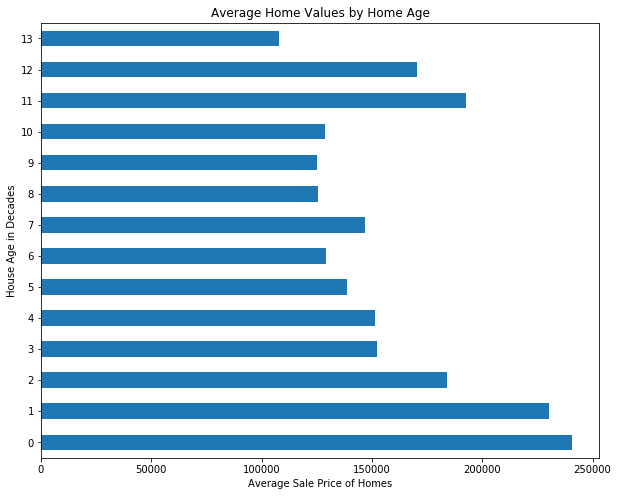
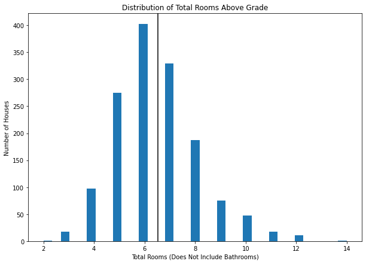
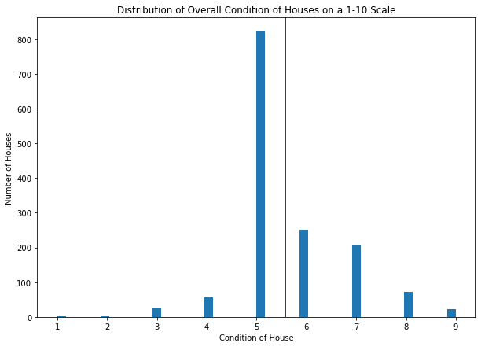
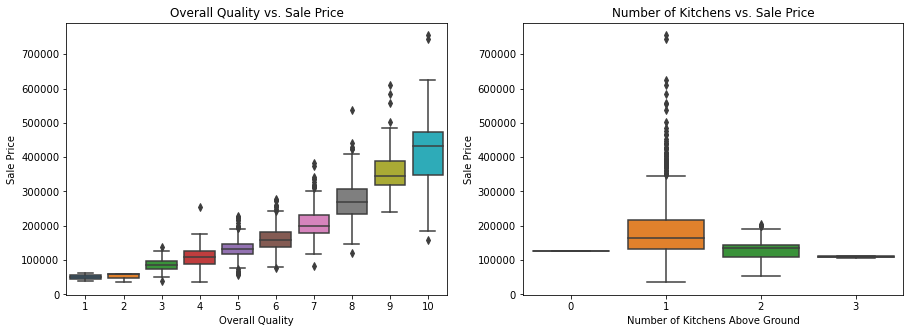

# EDA with Pandas - Cumulative Lab

## Introduction

In this section, you've learned a lot about importing, cleaning up, analyzing (using descriptive statistics) and visualizing data. In this cumulative lab, you'll get a chance to practice all of these skills with the Ames Housing dataset, which contains information about home sales in Ames, Iowa between 2006 and 2010.

## Objectives

You will be able to:

* Practice loading data with pandas
* Practice calculating measures of centrality and dispersion with pandas
* Practice creating subsets of data with pandas
* Practice using data visualizations to explore data, and interpreting those visualizations
* Perform a full exploratory data analysis process to gain insight about a dataset 

## Your Task: Explore the Ames Housing Dataset with Pandas


Photo by <a href="https://unsplash.com/@mattdonders?utm_source=unsplash&utm_medium=referral&utm_content=creditCopyText">Matt Donders</a> on <a href="/@mattdonders?utm_source=unsplash&utm_medium=referral&utm_content=creditCopyText">Unsplash</a>


### Data Understanding

Each record (row) in this dataset represents a home that was sold in Ames, IA.

Each feature (column) in this dataset is some attribute of that home sale. You can view the file `data/data_description.txt` in this repository for a full explanation of all variables in this dataset — 80 columns in total.

We are going to focus on the following features:

**SalePrice**: `Sale price of the house in dollars`

**TotRmsAbvGrd**: `Total rooms above grade (does not include bathrooms)`

**OverallCond**: `Rates the overall condition of the house`
```
       10	Very Excellent
       9	 Excellent
       8	 Very Good
       7	 Good
       6	 Above Average	
       5	 Average
       4	 Below Average	
       3	 Fair
       2	 Poor
       1	 Very Poor
```

**YrSold**: `Year Sold (YYYY)`

**YearBuilt**: `Original construction date`

**LandSlope**: `Slope of property`
```
       Gtl	Gentle slope
       Mod	Moderate Slope	
       Sev	Severe Slope
```

### Requirements

In this lab you will use your data munging and visualization skills to conduct an exploratory analysis of the dataset.

#### 1. Load the Dataset with Pandas

Import pandas with the standard alias `pd` and load the data into a dataframe with the standard name `df`.

#### 2. Explore Data Distributions

Produce summary statistics, visualizations, and interpretive text describing the distributions of `SalePrice`, `TotRmsAbvGrd`, and `OverallCond`.

#### 3. Explore Differences between Subsets

Separate the data into subsets based on `OverallCond`, then demonstrate how this split impacts the distribution of `SalePrice`.

#### 4. Explore Correlations

Find the features that have the strongest positive and negative correlations with `SalePrice`, and produce plots representing these relationships.

#### 5. Engineer and Explore a New Feature

Create a new feature `Age`, which represents the difference between the year sold and the year built, and plot the relationship between the age and sale price.

## 1. Load the Dataset with Pandas

In the cell below, import:
* `pandas` with the standard alias `pd`
* `matplotlib.pyplot` with the standard alias `plt`

And set `%matplotlib inline` so the graphs will display immediately below the cell that creates them.


```python
# Let's get started importing the necessary libraries
import pandas as pd
import matplotlib.pyplot as plt
%matplotlib inline
```

Now, use pandas to open the file located at `data/ames.csv` ([documentation here](https://pandas.pydata.org/pandas-docs/stable/reference/api/pandas.read_csv.html)). Specify the argument `index_col=0` in order to avoid creating an extra `Id` column. Name the resulting dataframe `df`.


```python
# Loading the data
df = pd.read_csv('data/ames.csv', index_col=0)
```

The following code checks that you loaded the data correctly:


```python

# Check that df is a dataframe
assert type(df) == pd.DataFrame

# Check that there are the correct number of rows
assert df.shape[0] == 1460

# Check that there are the correct number of columns
# (if this crashes, make sure you specified `index_col=0`)
assert df.shape[1] == 80
```

Inspect the contents of the dataframe:


```python
df
```


<div>
<style scoped>
    .dataframe tbody tr th:only-of-type {
        vertical-align: middle;
    }

    .dataframe tbody tr th {
        vertical-align: top;
    }

    .dataframe thead th {
        text-align: right;
    }
</style>
<table border="1" class="dataframe">
  <thead>
    <tr style="text-align: right;">
      <th></th>
      <th>MSSubClass</th>
      <th>MSZoning</th>
      <th>LotFrontage</th>
      <th>LotArea</th>
      <th>Street</th>
      <th>Alley</th>
      <th>LotShape</th>
      <th>LandContour</th>
      <th>Utilities</th>
      <th>LotConfig</th>
      <th>...</th>
      <th>PoolArea</th>
      <th>PoolQC</th>
      <th>Fence</th>
      <th>MiscFeature</th>
      <th>MiscVal</th>
      <th>MoSold</th>
      <th>YrSold</th>
      <th>SaleType</th>
      <th>SaleCondition</th>
      <th>SalePrice</th>
    </tr>
    <tr>
      <th>Id</th>
      <th></th>
      <th></th>
      <th></th>
      <th></th>
      <th></th>
      <th></th>
      <th></th>
      <th></th>
      <th></th>
      <th></th>
      <th></th>
      <th></th>
      <th></th>
      <th></th>
      <th></th>
      <th></th>
      <th></th>
      <th></th>
      <th></th>
      <th></th>
      <th></th>
    </tr>
  </thead>
  <tbody>
    <tr>
      <th>1</th>
      <td>60</td>
      <td>RL</td>
      <td>65.0</td>
      <td>8450</td>
      <td>Pave</td>
      <td>NaN</td>
      <td>Reg</td>
      <td>Lvl</td>
      <td>AllPub</td>
      <td>Inside</td>
      <td>...</td>
      <td>0</td>
      <td>NaN</td>
      <td>NaN</td>
      <td>NaN</td>
      <td>0</td>
      <td>2</td>
      <td>2008</td>
      <td>WD</td>
      <td>Normal</td>
      <td>208500</td>
    </tr>
    <tr>
      <th>2</th>
      <td>20</td>
      <td>RL</td>
      <td>80.0</td>
      <td>9600</td>
      <td>Pave</td>
      <td>NaN</td>
      <td>Reg</td>
      <td>Lvl</td>
      <td>AllPub</td>
      <td>FR2</td>
      <td>...</td>
      <td>0</td>
      <td>NaN</td>
      <td>NaN</td>
      <td>NaN</td>
      <td>0</td>
      <td>5</td>
      <td>2007</td>
      <td>WD</td>
      <td>Normal</td>
      <td>181500</td>
    </tr>
    <tr>
      <th>3</th>
      <td>60</td>
      <td>RL</td>
      <td>68.0</td>
      <td>11250</td>
      <td>Pave</td>
      <td>NaN</td>
      <td>IR1</td>
      <td>Lvl</td>
      <td>AllPub</td>
      <td>Inside</td>
      <td>...</td>
      <td>0</td>
      <td>NaN</td>
      <td>NaN</td>
      <td>NaN</td>
      <td>0</td>
      <td>9</td>
      <td>2008</td>
      <td>WD</td>
      <td>Normal</td>
      <td>223500</td>
    </tr>
    <tr>
      <th>4</th>
      <td>70</td>
      <td>RL</td>
      <td>60.0</td>
      <td>9550</td>
      <td>Pave</td>
      <td>NaN</td>
      <td>IR1</td>
      <td>Lvl</td>
      <td>AllPub</td>
      <td>Corner</td>
      <td>...</td>
      <td>0</td>
      <td>NaN</td>
      <td>NaN</td>
      <td>NaN</td>
      <td>0</td>
      <td>2</td>
      <td>2006</td>
      <td>WD</td>
      <td>Abnorml</td>
      <td>140000</td>
    </tr>
    <tr>
      <th>5</th>
      <td>60</td>
      <td>RL</td>
      <td>84.0</td>
      <td>14260</td>
      <td>Pave</td>
      <td>NaN</td>
      <td>IR1</td>
      <td>Lvl</td>
      <td>AllPub</td>
      <td>FR2</td>
      <td>...</td>
      <td>0</td>
      <td>NaN</td>
      <td>NaN</td>
      <td>NaN</td>
      <td>0</td>
      <td>12</td>
      <td>2008</td>
      <td>WD</td>
      <td>Normal</td>
      <td>250000</td>
    </tr>
    <tr>
      <th>...</th>
      <td>...</td>
      <td>...</td>
      <td>...</td>
      <td>...</td>
      <td>...</td>
      <td>...</td>
      <td>...</td>
      <td>...</td>
      <td>...</td>
      <td>...</td>
      <td>...</td>
      <td>...</td>
      <td>...</td>
      <td>...</td>
      <td>...</td>
      <td>...</td>
      <td>...</td>
      <td>...</td>
      <td>...</td>
      <td>...</td>
      <td>...</td>
    </tr>
    <tr>
      <th>1456</th>
      <td>60</td>
      <td>RL</td>
      <td>62.0</td>
      <td>7917</td>
      <td>Pave</td>
      <td>NaN</td>
      <td>Reg</td>
      <td>Lvl</td>
      <td>AllPub</td>
      <td>Inside</td>
      <td>...</td>
      <td>0</td>
      <td>NaN</td>
      <td>NaN</td>
      <td>NaN</td>
      <td>0</td>
      <td>8</td>
      <td>2007</td>
      <td>WD</td>
      <td>Normal</td>
      <td>175000</td>
    </tr>
    <tr>
      <th>1457</th>
      <td>20</td>
      <td>RL</td>
      <td>85.0</td>
      <td>13175</td>
      <td>Pave</td>
      <td>NaN</td>
      <td>Reg</td>
      <td>Lvl</td>
      <td>AllPub</td>
      <td>Inside</td>
      <td>...</td>
      <td>0</td>
      <td>NaN</td>
      <td>MnPrv</td>
      <td>NaN</td>
      <td>0</td>
      <td>2</td>
      <td>2010</td>
      <td>WD</td>
      <td>Normal</td>
      <td>210000</td>
    </tr>
    <tr>
      <th>1458</th>
      <td>70</td>
      <td>RL</td>
      <td>66.0</td>
      <td>9042</td>
      <td>Pave</td>
      <td>NaN</td>
      <td>Reg</td>
      <td>Lvl</td>
      <td>AllPub</td>
      <td>Inside</td>
      <td>...</td>
      <td>0</td>
      <td>NaN</td>
      <td>GdPrv</td>
      <td>Shed</td>
      <td>2500</td>
      <td>5</td>
      <td>2010</td>
      <td>WD</td>
      <td>Normal</td>
      <td>266500</td>
    </tr>
    <tr>
      <th>1459</th>
      <td>20</td>
      <td>RL</td>
      <td>68.0</td>
      <td>9717</td>
      <td>Pave</td>
      <td>NaN</td>
      <td>Reg</td>
      <td>Lvl</td>
      <td>AllPub</td>
      <td>Inside</td>
      <td>...</td>
      <td>0</td>
      <td>NaN</td>
      <td>NaN</td>
      <td>NaN</td>
      <td>0</td>
      <td>4</td>
      <td>2010</td>
      <td>WD</td>
      <td>Normal</td>
      <td>142125</td>
    </tr>
    <tr>
      <th>1460</th>
      <td>20</td>
      <td>RL</td>
      <td>75.0</td>
      <td>9937</td>
      <td>Pave</td>
      <td>NaN</td>
      <td>Reg</td>
      <td>Lvl</td>
      <td>AllPub</td>
      <td>Inside</td>
      <td>...</td>
      <td>0</td>
      <td>NaN</td>
      <td>NaN</td>
      <td>NaN</td>
      <td>0</td>
      <td>6</td>
      <td>2008</td>
      <td>WD</td>
      <td>Normal</td>
      <td>147500</td>
    </tr>
  </tbody>
</table>
<p>1460 rows × 80 columns</p>
</div>


```python
df.info()
```

    <class 'pandas.core.frame.DataFrame'>
    Int64Index: 1460 entries, 1 to 1460
    Data columns (total 80 columns):
     #   Column         Non-Null Count  Dtype  
    ---  ------         --------------  -----  
     0   MSSubClass     1460 non-null   int64  
     1   MSZoning       1460 non-null   object 
     2   LotFrontage    1201 non-null   float64
     3   LotArea        1460 non-null   int64  
     4   Street         1460 non-null   object 
     5   Alley          91 non-null     object 
     6   LotShape       1460 non-null   object 
     7   LandContour    1460 non-null   object 
     8   Utilities      1460 non-null   object 
     9   LotConfig      1460 non-null   object 
     10  LandSlope      1460 non-null   object 
     11  Neighborhood   1460 non-null   object 
     12  Condition1     1460 non-null   object 
     13  Condition2     1460 non-null   object 
     14  BldgType       1460 non-null   object 
     15  HouseStyle     1460 non-null   object 
     16  OverallQual    1460 non-null   int64  
     17  OverallCond    1460 non-null   int64  
     18  YearBuilt      1460 non-null   int64  
     19  YearRemodAdd   1460 non-null   int64  
     20  RoofStyle      1460 non-null   object 
     21  RoofMatl       1460 non-null   object 
     22  Exterior1st    1460 non-null   object 
     23  Exterior2nd    1460 non-null   object 
     24  MasVnrType     1452 non-null   object 
     25  MasVnrArea     1452 non-null   float64
     26  ExterQual      1460 non-null   object 
     27  ExterCond      1460 non-null   object 
     28  Foundation     1460 non-null   object 
     29  BsmtQual       1423 non-null   object 
     30  BsmtCond       1423 non-null   object 
     31  BsmtExposure   1422 non-null   object 
     32  BsmtFinType1   1423 non-null   object 
     33  BsmtFinSF1     1460 non-null   int64  
     34  BsmtFinType2   1422 non-null   object 
     35  BsmtFinSF2     1460 non-null   int64  
     36  BsmtUnfSF      1460 non-null   int64  
     37  TotalBsmtSF    1460 non-null   int64  
     38  Heating        1460 non-null   object 
     39  HeatingQC      1460 non-null   object 
     40  CentralAir     1460 non-null   object 
     41  Electrical     1459 non-null   object 
     42  1stFlrSF       1460 non-null   int64  
     43  2ndFlrSF       1460 non-null   int64  
     44  LowQualFinSF   1460 non-null   int64  
     45  GrLivArea      1460 non-null   int64  
     46  BsmtFullBath   1460 non-null   int64  
     47  BsmtHalfBath   1460 non-null   int64  
     48  FullBath       1460 non-null   int64  
     49  HalfBath       1460 non-null   int64  
     50  BedroomAbvGr   1460 non-null   int64  
     51  KitchenAbvGr   1460 non-null   int64  
     52  KitchenQual    1460 non-null   object 
     53  TotRmsAbvGrd   1460 non-null   int64  
     54  Functional     1460 non-null   object 
     55  Fireplaces     1460 non-null   int64  
     56  FireplaceQu    770 non-null    object 
     57  GarageType     1379 non-null   object 
     58  GarageYrBlt    1379 non-null   float64
     59  GarageFinish   1379 non-null   object 
     60  GarageCars     1460 non-null   int64  
     61  GarageArea     1460 non-null   int64  
     62  GarageQual     1379 non-null   object 
     63  GarageCond     1379 non-null   object 
     64  PavedDrive     1460 non-null   object 
     65  WoodDeckSF     1460 non-null   int64  
     66  OpenPorchSF    1460 non-null   int64  
     67  EnclosedPorch  1460 non-null   int64  
     68  3SsnPorch      1460 non-null   int64  
     69  ScreenPorch    1460 non-null   int64  
     70  PoolArea       1460 non-null   int64  
     71  PoolQC         7 non-null      object 
     72  Fence          281 non-null    object 
     73  MiscFeature    54 non-null     object 
     74  MiscVal        1460 non-null   int64  
     75  MoSold         1460 non-null   int64  
     76  YrSold         1460 non-null   int64  
     77  SaleType       1460 non-null   object 
     78  SaleCondition  1460 non-null   object 
     79  SalePrice      1460 non-null   int64  
    dtypes: float64(3), int64(34), object(43)
    memory usage: 923.9+ KB


## 2. Explore Data Distributions

Write code to produce histograms showing the distributions of `SalePrice`, `TotRmsAbvGrd`, and `OverallCond`.

Each histogram should have appropriate title and axes labels, as well as a black vertical line indicating the mean of the dataset. See the documentation for [plotting histograms](https://matplotlib.org/stable/api/_as_gen/matplotlib.axes.Axes.hist.html), [customizing axes](https://matplotlib.org/stable/api/axes_api.html#axis-labels-title-and-legend), and [plotting vertical lines](https://matplotlib.org/stable/api/_as_gen/matplotlib.axes.Axes.axvline.html#matplotlib.axes.Axes.axvline) as needed.

### Sale Price

In the cell below, produce a histogram for `SalePrice`.


```python

# This solution uses a function to avoid repeated code, but a 
# function is not 100% necessary. You could replace each of the
# parameters with a hard-coded value instead.

def plot_histogram(df, column, title, xlabel, ylabel):
    # Extract the relevant data
    data = df[column]
    mean = data.mean()
    # Set up plot
    fig, ax = plt.subplots(figsize=(10,7))
    # Plot histogram
    ax.hist(data, bins="auto")
    # Plot vertical line
    ax.axvline(mean, color="black")
    # Customize title and axes labels
    ax.set_title(title)
    ax.set_xlabel(xlabel)
    ax.set_ylabel(ylabel)

plot_histogram(
    df,
    "SalePrice",
    "Distribution of Sale Prices",
    "Sale Price",
    "Number of Houses"
)
```


    

    


Now, print out the mean, median, and standard deviation:


```python

# Again, a function is not necessary here, but it
# helps to avoid repetition

def print_stats(df, column):    
    print("Mean:              ", df[column].mean())
    print("Median:            ", df[column].median())
    print("Standard Deviation:", df[column].std())
    
print_stats(df, "SalePrice")
```

    Mean:               180921.19589041095
    Median:             163000.0
    Standard Deviation: 79442.50288288662


In the cell below, interpret the above information.


```python
"""
Looks like a log normal distribution. Most houses in this sample are
clustered around the median value of $163,000, but the higher-end
homes are pulling the mean up to over $180,000
"""
```

### Total Rooms Above Grade

In the cell below, produce a histogram for `TotRmsAbvGrd`.


```python

# Here we are reusing the function created for the previous step

plot_histogram(
    df,
    "TotRmsAbvGrd",
    "Distribution of Total Rooms Above Grade",
    "Total Rooms (Does Not Include Bathrooms)",
    "Number of Houses"
)
```


    

    


Now, print out the mean, median, and standard deviation:


```python

print_stats(df, "TotRmsAbvGrd")
```

    Mean:               6.517808219178082
    Median:             6.0
    Standard Deviation: 1.6253932905840505


In the cell below, interpret the above information.


```python
"""
The number of rooms in houses is approximately normally distributed, 
with a mean and median around 6 rooms. There are some houses with
twice as many rooms as the average, but overall the distribution is
less skewed than the sale price distribution
"""
```

### Overall Condition

In the cell below, produce a histogram for `OverallCond`.


```python

# We are again reusing the same function

plot_histogram(
    df,
    "OverallCond",
    "Distribution of Overall Condition of Houses on a 1-10 Scale",
    "Condition of House",
    "Number of Houses"
)
```


    

    


Now, print out the mean, median, and standard deviation:


```python

print_stats(df, "OverallCond")
```

    Mean:               5.575342465753424
    Median:             5.0
    Standard Deviation: 1.1127993367127316


In the cell below, interpret the above information.


```python
"""
Most homes have a condition of 5. It seems like we should
treat this as a categorical rather than numeric variable,
since the difference between conditions is so abrupt
"""
```

## 3. Explore Differences between Subsets

As you might have noted in the previous step, the overall condition of the house seems like we should treat it as more of a categorical variable, rather than a numeric variable.

One useful way to explore a categorical variable is to create subsets of the full dataset based on that categorical variable, then plot their distributions based on some other variable. Since this dataset is traditionally used for predicting the sale price of a house, let's use `SalePrice` as that other variable.

In the cell below, create three variables, each of which represents a record-wise subset of `df` (meaning, it has the same columns as `df`, but only some of the rows).

* `below_average_condition`: home sales where the overall condition was less than 5
* `average_condition`: home sales where the overall condition was exactly 5
* `above_average_condition`: home sales where the overall condition was greater than 5


```python
below_average_condition = df[df["OverallCond"] < 5]
average_condition = df[df["OverallCond"] == 5]
above_average_condition = df[df["OverallCond"] > 5]
```

The following code checks that you created the subsets correctly:


```python

# Check that all of them still have 80 columns
assert below_average_condition.shape[1] == 80
assert average_condition.shape[1] == 80
assert above_average_condition.shape[1] == 80

# Check the numbers of rows of each subset
assert below_average_condition.shape[0] == 88
assert average_condition.shape[0] == 821
assert above_average_condition.shape[0] == 551
```

The following code will produce a plot of the distributions of sale price for each of these subsets:


```python

# Set up plot
fig, ax = plt.subplots(figsize=(15,5))

# Create custom bins so all are on the same scale
bins = range(df["SalePrice"].min(), df["SalePrice"].max(), int(df["SalePrice"].median()) // 20)

# Plot three histograms, with reduced opacity (alpha) so we
# can see them overlapping
ax.hist(
    x=above_average_condition["SalePrice"],
    label="above average condition",
    bins=bins,
    color="cyan",
    alpha=0.5
)
ax.hist(
    x=average_condition["SalePrice"],
    label="average condition",
    bins=bins,
    color="gray",
    alpha=0.3
)
ax.hist(
    x=below_average_condition["SalePrice"],
    label="below average condition",
    bins=bins,
    color="yellow",
    alpha=0.5
)

# Customize labels
ax.set_title("Distributions of Sale Price Grouped by Condition")
ax.set_xlabel("Sale Price")
ax.set_ylabel("Number of Houses")
ax.legend();
```


    

    


Interpret the plot above. What does it tell us about these overall condition categories, and the relationship between overall condition and sale price? Is there anything surprising?


```python
"""
First, we note again that the majority of the houses have average
condition, then about 1/3 have above average condition, then less
than 10% have below average condition.

As we might expect, the average condition therefore contains houses
across a broader spectrum of the sale price range than either the
below-average or above-average houses.

Another unsurprising finding is that below-average condition houses
have a price distribution that is much lower than average or
above-average condition houses.

But what might be surprising is that above-average condition houses
do not seem to have higher average sale prices than average condition
houses. In fact, above-average condition houses seem more clustered
around a particular price range, especially the $100,000 to $200,000
range, whereas average condition houses are more frequent above
$200,000. We might want to investigate further to understand what
kinds of houses are rated as above-average condition, since this goes
against a standard assumption that better condition would mean higher
cost.
"""
```

## 4. Explore Correlations

To understand more about what features of these homes lead to higher sale prices, let's look at some correlations. We'll return to using the full `df`, rather than the subsets.

In the cell below, print out both the name of the column and the Pearson correlation for the column that is ***most positively correlated*** with `SalePrice` (other than `SalePrice`, which is perfectly correlated with itself).

We'll only check the correlations with some kind of numeric data type.

You can import additional libraries, although it is possible to do this just using pandas.


```python

# There are a couple ways to do this

### NumPy way ###

print("NumPy way")
import numpy as np

# Create a df that contains only numeric columns
# and doesn't include SalePrice
numeric_df = df.select_dtypes(include='number').copy()
numeric_df.drop("SalePrice", axis=1, inplace=True)

# Create list of correlations
correlations = []
for col in numeric_df.columns:    
    corr = np.corrcoef(df[col], df["SalePrice"])[0][1]
    # ^ you could also substitute
    # corr = scipy.stats.pearsonr(df[col], df["SalePrice"])[0]
    # if you wanted to use SciPy rather than NumPy
    correlations.append(corr)

# Find the largest value, and the column name at that index
max_corr_value = max(correlations)
max_corr_column = numeric_df.columns[correlations.index(max_corr_value)]
print("Most Positively Correlated Column:", max_corr_column)
print("Maximum Correlation Value:", max_corr_value)

### Much shorter pandas solution ###

print("\npandas way")
# Get a list of correlations with SalePrice, sorted from smallest
# to largest
correlation_series = df.corr(numeric_only = True)['SalePrice'].sort_values()
# Select second to last correlation, since the highest (last)
# correlation will be SalePrice correlating 100% with itself
max_corr_value = correlation_series.iloc[-2]
max_corr_column = correlation_series.index[-2]
print("Most Positively Correlated Column:", max_corr_column)
print("Maximum Correlation Value:", max_corr_value)

# Note that there are very small differences in these numbers due to
# floating point rounding errors
```

    NumPy way
    Most Positively Correlated Column: OverallQual
    Maximum Correlation Value: 0.7909816005838044
    
    pandas way
    Most Positively Correlated Column: OverallQual
    Maximum Correlation Value: 0.7909816005838047


Now, find the ***most negatively correlated*** column:


```python

### NumPy way ###

print("NumPy way")

min_corr_value = min(correlations)
min_corr_column = numeric_df.columns[correlations.index(min_corr_value)]

print("Most Negatively Correlated Column:", min_corr_column)
print("Minimum Correlation Value:", min_corr_value)

### pandas way ###

print ("\npandas way")

# We can just find the smallest value, not the second smallest,
# since we aren't avoiding the perfect correlation with itself
min_corr_value = correlation_series.iloc[0]
min_corr_column = correlation_series.index[0]

print("Most Negatively Correlated Column:", min_corr_column)
print("Minimum Correlation Value:", min_corr_value)
```

    NumPy way
    Most Negatively Correlated Column: KitchenAbvGr
    Minimum Correlation Value: -0.13590737084214122
    
    pandas way
    Most Negatively Correlated Column: KitchenAbvGr
    Minimum Correlation Value: -0.1359073708421417


Once you have your answer, edit the code below so that it produces a box plot of the relevant columns.


```python

import seaborn as sns

fig, (ax1, ax2) = plt.subplots(ncols=2, figsize=(15,5))

# Plot distribution of column with highest correlation
sns.boxplot(
    x=df[max_corr_column],
    y=df["SalePrice"],
    ax=ax1
)
# Plot distribution of column with most negative correlation
sns.boxplot(
    x=df[min_corr_column],
    y=df["SalePrice"],
    ax=ax2
)

# Customize labels
ax1.set_title("Overall Quality vs. Sale Price")
ax1.set_xlabel("Overall Quality")
ax1.set_ylabel("Sale Price")
ax2.set_title("Number of Kitchens vs. Sale Price")
ax2.set_xlabel("Number of Kitchens Above Ground")
ax2.set_ylabel("Sale Price");
```


    

    


Interpret the results below. Consult `data/data_description.txt` as needed.


```python
"""
The column with the highest correlation is overall quality.
According to the data description:

OverallQual: Rates the overall material and finish of the house

       10	Very Excellent
       9	Excellent
       8	Very Good
       7	Good
       6	Above Average
       5	Average
       4	Below Average
       3	Fair
       2	Poor
       1	Very Poor
       
It is somewhat difficult to understand how this is different from
OverallCond, which has similar values.

There is a clear positive relationship between overall quality and
sale price, although it looks like potentially an exponential
relationship rather than a linear one. For example, the minimum
"non-outlier" (Q1 - 1.5*IQR) home with quality 10 (Very Excellent)
sells for about the same price as the median home with quality 6
(Above Average).

The column with the most negative correlation is the number of 
kitchens above ground. According to the data description:

KitchenAbvGr: Kitchens above grade

From the plot, it is clear that almost all houses have 1 or 2
kitchens above grade, although there are some with 0 or 3.

Somewhat similar to the earlier OverallCond discussion, it seems
that more kitchens are associated with lower price, which is
somewhat counterintuitive. Essentially all of the houses with 2
kitchens sold for less than $200,000, whereas homes with 1 kitchen
sometimes sold for much more.

One thing we might want to investigate is what kinds of homes have
two kitchens. Are they also homes with low quality, possibly student
housing at Iowa State University?
"""
```

## 5. Engineer and Explore a New Feature

Here the code is written for you, all you need to do is interpret it.

We note that the data spans across several years of sales:


```python
df["YrSold"].value_counts().sort_index()
```


    2006    314
    2007    329
    2008    304
    2009    338
    2010    175
    Name: YrSold, dtype: int64


Maybe we can learn something interesting from the age of the home when it was sold. This uses information from the `YrBuilt` and `YrSold` columns, but represents a truly distinct feature.


```python

# Make a new column, Age
df["Age"] = df["YrSold"] - df["YearBuilt"]

# Set up plot
fig, ax = plt.subplots(figsize=(15,5))

# Plot Age vs. SalePrice
ax.scatter(df["Age"], df["SalePrice"], alpha=0.3, color="green")
ax.set_title("Home Age vs. Sale Price")
ax.set_xlabel("Age of Home at Time of Sale")
ax.set_ylabel("Sale Price");
```


    

    


Interpret this plot below:


```python
"""
In general, newer houses appear to be more valuable, with value increasing
as homes age. Interestingly the variance seems to increase once the home
age goes over 100 years, with several above-average sale prices and fewer
home sales in general.

We are also seeing potential housing booms and busts over the past decades,
indicated by e.g. relatively few 20-year-old houses compared to 25-year-old houses
being sold. We might find something interesting if we investigae this further.
"""
```

## Summary

Congratulations, you've completed an exploratory data analysis of a popular dataset. You saw how to inspect the distributions of individual columns, subsets of columns, correlations, and new engineered features.
